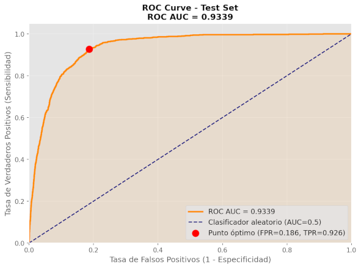
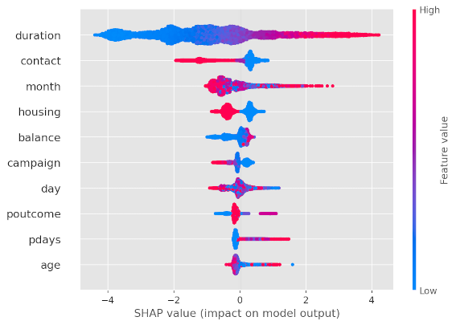
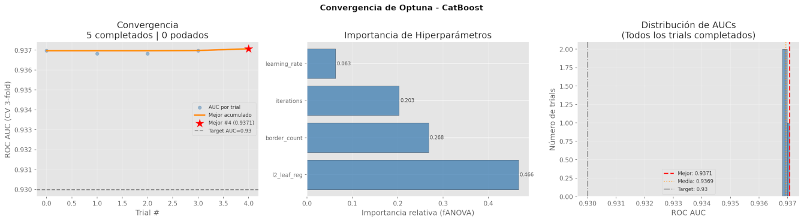

https://archive.ics.uci.edu/dataset/222/bank+marketing


### 📊 Bank Marketing Prediction
#### CatBoost + Optuna Optimization for high Class Imbalance

Machine learning project focused on **predicting the success of bank marketing campaigns** using **CatBoost** with **Optuna hyperparameter optimization**, handling **high class imbalance (7.5:1)** and achieving **ROC AUC > 0.93.**

#### 🚀 TL;DR

- Problem: Predict if a client will subscribe to a bank product
- Dataset imbalance: **399,922 vs 5289 samples**
- Model: **CatBoostClassifier**
- Optimization: **Optuna (TPE + Median Pruner)**
- Evaluation: **ROC AUC, Precision-Recall, F1**
- Interpretability: **SHAP**

Final result:
```
ROC AUC > 0.93
```
---

#### 🧠 Problem

Bank marketing campaigns typically have **very low conversion rates.**
Predicting which customers are likely to subscribe allows banks to:

- reduce marketing costs
- target high-probability clients
- increase campaign ROI

However, the dataset presents **high class imbalance.**

| Class | Description            | Samples |
| ----- | ---------------------- | ------- |
| 0     | Unsuccessful Marketing | 399,922 |
| 1     | Successful Marketing   |    5289 |

Imbalance ratio:
```
7.5 : 1
```
---

#### ⚙️ Machine Learning Pipeline
#### 1️⃣ Data Processing

Steps performed:

- Raw CSV cleaning
- Delimiter normalization
- Label encoding for categorical variables
- Stratified train-test split
```
Train: 80%
Test: 20%
```
Reproducibility:
```
RANDOM_STATE = 42
```
---

#### 🤖 Model

The model used is:
```
CatBoostClassifier
```
Reasons for choosing CatBoost:

- excellent performance on tabular datasets
- robust with categorical features
- stable with imbalanced data
- minimal preprocessing

Key configuration:
```
depth = 6
loss_function = Logloss
eval_metric = AUC
scale_pos_weight = imbalance_ratio
```
---

#### 🔎 Hyperparameter Optimization

Optimization performed using **Optuna.**

Configuration:
```
Sampler → TPE
Pruner → MedianPruner
Cross-Validation → Stratified 4-Fold
```
Optimized parameters:

- iterations
- learning_rate
- l2_leaf_reg
- border_count

Objective:
```
maximize ROC AUC
```
---

#### 📈 Model Evaluation

Evaluation metrics:

- ROC AUC
- Precision-Recall Curve
- Average Precision
- F1 Score
- onfusion Matrix

Because the dataset is highly imbalanced, **Precision-Recall metrics are emphasized over accuracy.**

---

#### 🎯 Threshold Optimization

Instead of using the default classification threshold:
```
0.5
```
The threshold is optimized using **Precision-Recall analysis** to maximize:
```
F1-score
```
This improves the balance between:

- False Positives
- False Negatives

---

#### 📊 Model Performance

Final test performance:
```
ROC AUC > 0.93
```
Cross-validation stability:
```
Stratified 4-Fold ROC AUC
Mean ≈ high
Std ≈ low
```
---

#### 🔍 Model Explainability

Interpretability is implemented using **SHAP.**

Generated visualizations:

- SHAP Feature Importance
- SHAP Beeswarm Summary
- SHAP Waterfall Explanation
- SHAP Force Plot

These plots help understand **which features drive marketing success predictions.**

---

#### 📷 Example Visualizations

Example outputs generated by the pipeline:
```
ROC Curve
Precision-Recall Curve
Optuna Optimization History
Feature Importance
SHAP Summary
Confusion Matrix
```
**Model Performance**



**Average importance of features and their impact on prediction**



**Hyperparameter Optimization of Optuna and Catboost**



---

#### 🛠 Tech Stack

Main libraries used:

- Python
- Pandas
- NumPy
- Scikit-learn
- CatBoost
- Optuna
- SHAP
- Matplotlib
- Seaborn

📌 Key Takeaways

✔ CatBoost performs strongly on tabular datasets<br>
✔ Optuna efficiently finds optimal hyperparameters<br>
✔ Precision-Recall analysis is critical for imbalanced datasets<br>
✔ SHAP enables transparent model interpretability